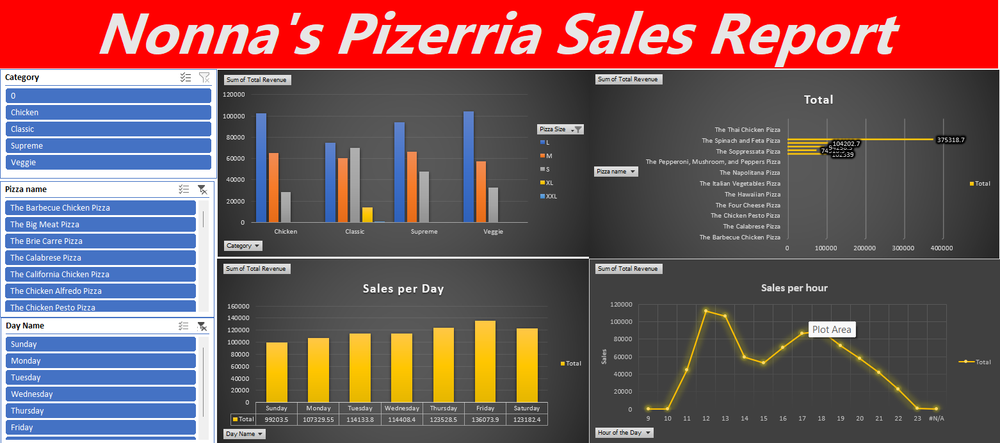

# 🍕 Pizza Place Sales Performance Dashboard (Excel Project)

## 📊 Project Overview
This project focuses on transforming fragmented, relational transactional data from a fictional pizza place into an interactive, executive-ready Business Intelligence dashboard using **Microsoft Excel**. By analyzing **48,000+ rows** of operational data spanning a full calendar year, this project identifies critical sales trends, peak operational bottlenecks, and product performance metrics to drive data-backed business recommendations.

The original dataset was sourced from Mysar Ahmad Bhat on Kaggle.

---

## 🛠️ Tech Stack & Advanced Skills Demonstrated
* **Data Modeling & Merging:** Structured relational tables across multiple sheets using nested architectural `XLOOKUP` functions to merge granular transaction line items (`order_details`) with master product profiles (`pizzas`, `pizza_types`) and timestamps (`orders`).
* **Performance Optimization:** Applied "Paste as Values" arrays to complex 48,000-row lookups, drastically reducing the workbook's background memory footprint, neutralizing calculation lag, and optimizing performance for analytics.
* **Feature Engineering:** Extracted discrete time-series metrics using `HOUR()` and text-formatted string functions (`TEXT(date, "dddd")`) to isolate peak chronological patterns.
* **Logical & Conditional Calculations:** Implemented advanced logical workflows using nested `IF` statements, conditional logic, and formatting rules to flag key operational performance thresholds and dynamically segment metrics.
* **UI/UX Dashboard Design:** Designed a high-fidelity visual layout from scratch. Stripped default gridlines to create a clean, modern application canvas utilizing dynamic Pivot Charts, synchronized multi-table Slicers, and responsive Shape KPI cards.

---

## ⚙️ Analytical Architecture (Pivot Tables Created)
To extract actionable business insights from the master data sheet, the following background Pivot Table engines were constructed:
1. **High-Level Business KPIs:** Aggregated `Sum of Total Revenue` and `Sum of Quantity` alongside a `Count of order_id` to establish foundational corporate health metrics (Total Revenue, Pizzas Sold, Total Orders).
2. **Hourly Sales Peak Engine:** Grouped transactions by the engineered `Hour of Day` metric to plot hourly revenue velocity and pinpoint high-volume delivery hours.
3. **Weekly Revenue Trends Engine:** Structured chronological performance by `Day Name` to isolate day-of-week sales fluctuations.
4. **Top 5 Best-Selling Pizzas:** Filtered `Pizza Name` records utilizing advanced **Top-N Value Filters** sorted by revenue to isolate the menu's highest-performing assets while streamlining the visual layer.

---

## 📈 Executive Business Insights & Recommendations
* **Operational Staffing:** Line chart analysis shows extreme demand surges between **5:00 PM and 8:00 PM**, particularly on **Fridays and Saturdays**. *Recommendation:* Implement staggered shifts to scale up kitchen and delivery staff during this specific 3-hour window to reduce order fulfillment bottlenecks.
* **Menu Optimization:** A localized Top 5 ranking highlights our highest revenue-generating products. *Recommendation:* Allocate prime visual real estate on physical/digital menus to these star items, and consider bundle promotions around the lower-performing items to clear inventory evenly.
* **Inventory Control:** Category and size breakdowns (Classic, Veggie, Supreme, Chicken) provide the exact material requirements needed to forecast weekly dough, cheese, and topping procurement schedules.

---

## 🖥️ Dashboard Visuals

---

## 📂 Repository Structure
* `/Data` : Contains the original raw relational CSV tables (`orders`, `order_details`, `pizzas`, `pizza_types`).
* `Pizza_Sales_Dashboard.zip` : The compressed project archive. **Please download and extract this folder to access the fully interactive `.xlsx` workbook containing the calculation engines and visual dashboard.**
* `README.md` : Project summary and business documentation.
